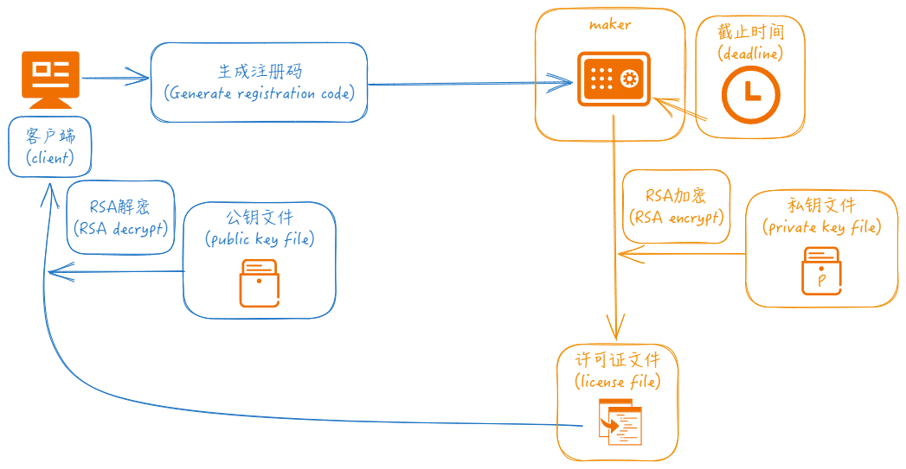

<h4 align="right"><strong><a href="README.md">简体中文</a></strong> | English</h4>


### tianzuo.Hundun


||||
|--|--|--|
|operating system|   ||
|compiler|      ||
|programming language|          ||
# introduction


**tianzuo.Hundun** Protect the software you develop from unauthorized copies, limit the usage in time, to a specific machines.

**legend:**
is the first of the ten ancient artifacts, known as the most powerful artifact. East Emperor bell is called East Emperor bell, its owner is East Emperor Taiyi, East Emperor Taiyi is ancient mythology, ranked among the top five god, as its magic weapon East Emperor bell, strength is not bad. According to legend, East Emperor Bell is the gate of heaven, controllable sun and moon, can change Yin and Yang, East Emperor Bell is a kind of strong defense, weak attack, but amazing explosive power, once the outbreak of real strength, basically can destroy heaven and earth, devour the heavens.

# motivation
Protect the software you develop from unauthorized copies, limit the usage in time, to a specific machines.



# features

- 🧩 simple integration
- 🪢 data is encrypted algorithmically
- 🔒 it can be limited by time, by device ID, or both

# workflow

In the client software, the get_machineid interface can be called to obtain the machine code (registration code), and then enter the registration code/cut-off time through the maker program to create the license file. The maker needs to read the private key file when generating the license file, and the corresponding public key information is input in the client software. After the license is issued to the client locally, the client invokes the check interface for verification.

1. Generate a public and private key pairing information file.
  
```bash
  (1) openssl genrsa -out privatekey.pem 2048                           // Create a private key file
  (2) openssl rsa -in privatekey.pem -pubout -out publickey.pem         // Create a public key file based on the private key file
```

2. Create a license file from the maker command line:

```bash
maker.exe --type=1 --date="2024-04-30" --keyfile="privatekey.pem"                                           // Generate only time-limited license files
maker.exe --type=2 --id="9ea03801651cd3d93add9d42a07d3c4b" --keyfile="privatekey.pem"                       // Only license files with machine code restrictions are generated
maker.exe --type=3 --date="2024-04-30" --id="9ea03801651cd3d93add9d42a07d3c4b" --keyfile="privatekey.pem"   // Generate license files that have both time and machine code limits
```

# example
<details>
  <summary>cpp</summary>

```cpp

```
</details>

<details>
  <summary>python</summary>

```python

```
</details>

<details>
  <summary>java</summary>

```java

```
</details>

<details>
  <summary>csharp</summary>

```csharp

```
</details>

<details>
  <summary>javascript</summary>

```js

```
</details>

<details>
  <summary>php</summary>

```php

```
</details>

<details>
  <summary>vb</summary>

```vb

```
</details>

<details>
  <summary>go</summary>

```go

```
</details>

<details>
  <summary>rust</summary>

```rust

```
</details>

<details>
  <summary>ruby</summary>

```ruby

```
</details>

# download

|||||
|--|--|--|--|
|[](https://github.com/zhengtianzuo/tianzuo.Hundun/releases)|[](https://gitee.com/zhengtianzuo/tianzuo.Hundun/releases)|[](https://pan.baidu.com/s/1MMBny5AbKTfKn0hWjV5BEw?pwd=1234)|[](https://share.weiyun.com/TtFiXpyV)|

# about
## contact

||||
|--|--|--|
|author|zhengtianzuo||
|QQ|278969898||
|mailbox|camelsoft@163.com||
|homepage|[http://www.camelstudio.cn](http://www.camelstudio.cn)||
|blog|[http://blog.csdn.net/zhengtianzuo06](http://blog.csdn.net/zhengtianzuo06)||
|github|[https://github.com/zhengtianzuo](https://github.com/zhengtianzuo)||
|gitee|[https://gitee.com/zhengtianzuo](https://gitee.com/zhengtianzuo)||
|QQ group|199672080||


||||||
|--|--|--|--|--|
|Add QQ Friends|Add WeChat Friends|Paid Questions|WeChat Sponsor|Alipay Sponsor|


